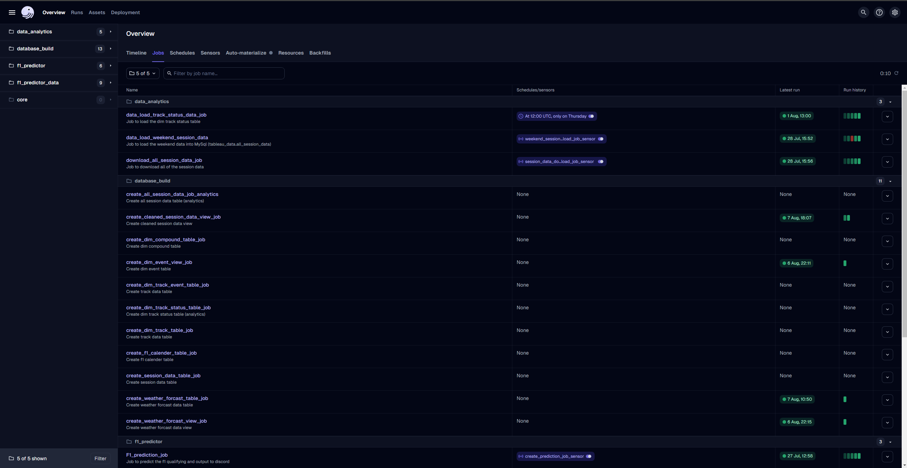
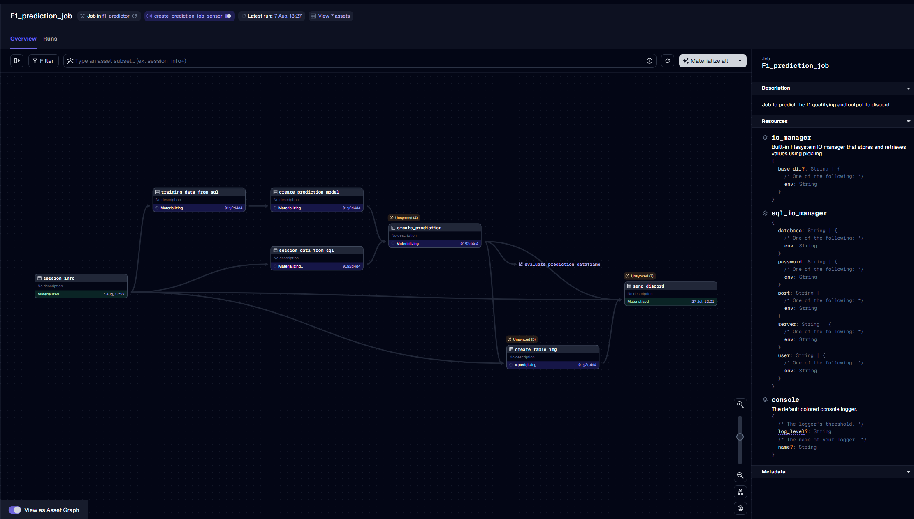
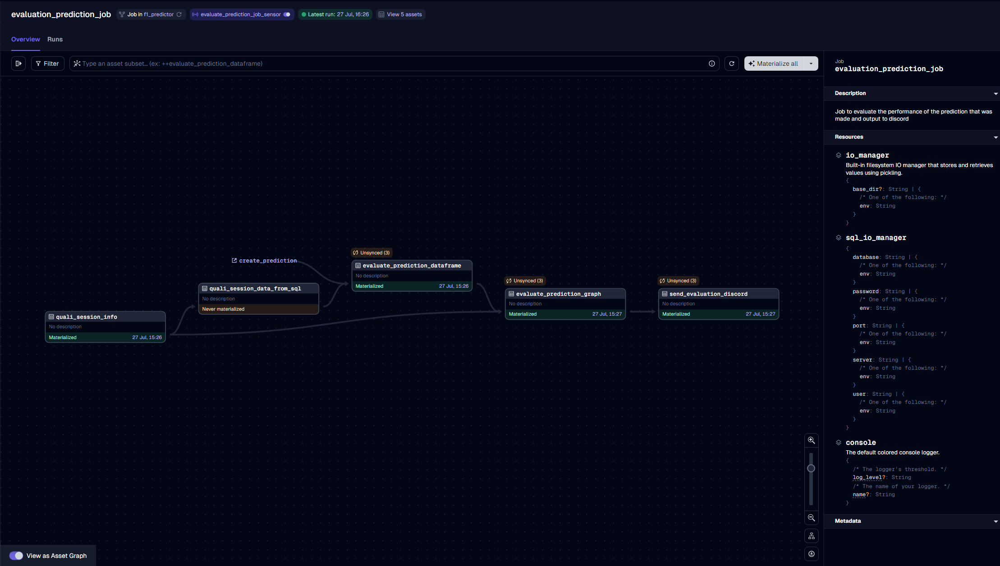
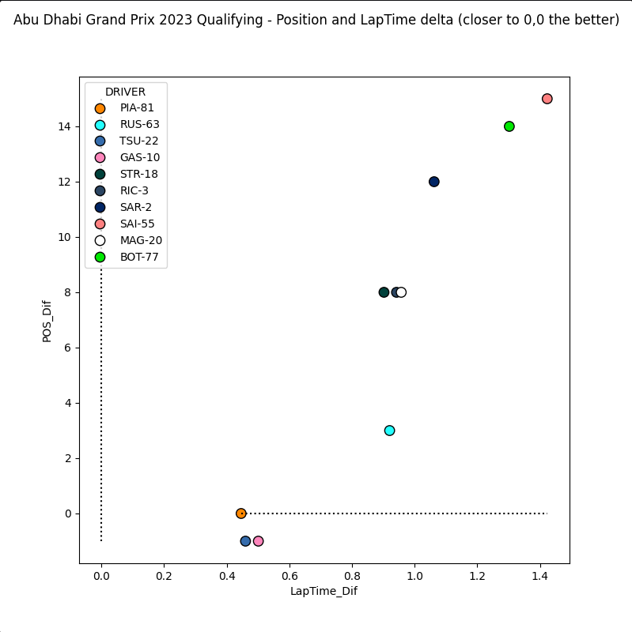

# Dagster

    

## About The Project
I am using Dagster to automate my F1 machine learning model that attempts to predict the F1 qualifying results. The
model that is currently being used is using linear regression what is based off all the practice and qualifying results
since 2018. The model is currently build using the scikit-learn module. This project also includes a MySQL database that 
is used to store the data in the model as well as holds all the Dagster instance data (run history, sensor history 
etc.). This database has got five different schemas that are used:

- ml_project_dev
- ml_project_prod
- tableau_data
- dagster_logs_dev 
- dagster_logs_prod

Within the dagster instance there is five different workspaces. These are used to separate the different processes due 
to a large number of jobs.

### F1_Predictor

This workspace holds the main assets and jobs that power the prediction model and evaluation. The jobs that are in this
workspace are: 

- F1_Prediction_Job

    

- Evaluation_Prediction_Job

    

Both of these jobs use sensors to check if the data is available for the practice sessions from the API and will launch
the run with the correct config. The prediction job will output a table of the predicted result into a Discord server 
with the predicted time and position for each driver. 

I also evaluate the performance of the model and compare to the actual results of qualifying by plotting the 
qualifying time against the predicted as well as doing the same for the position. This is potted using matplotlib. 

     
    

### f1_predictor_data

This workspace is all things data! This is workspace keeps all the tables in the MySQL server up to date. There are 
currently six jobs that are in this workspace: 

- session_data_load_job - Loads all the available data from the API (2018+)
- weekend_session_data_load_job - Loads the data from the most recent weekend
- load_compound_data_job - Loads the dim_compound table
- load_track_data_job - Loads the dim_track table
- load_weather_forcast_data_job - Partitioned job that loads the daily weather forcast
- update_calendar_job - Loads the F1 calendar and creates CSV output for the sensors

The weekend session data uses a sensor to detect when the data is available from the qualifying session and will collect 
and upload the data into the MySQL database. The session data jobs also uses a sensor to check if there is data in the
main data table and will launch a run if the table is empty. All the other jobs have weekly/daily schedules.

### data_analytics

I am currently working on building a Tableau dashboard for that can show give an overview of a race and show position 
changes throughout the race. This is still a work in process but this workspace contains three jobs. 

- data_load_weekend_session_data - after each weekend will load all the lap data
- data_load_track_status_job - load the dim_track_status table
- download_all_session_data_job - will download a CSV will all the data for use in the dashboard

The track status job is a weekly job that will update the table. The other two jobs use sensors that as will detect when
the new session data is available and then will check if the table has a different number of rows to the latest CSV 
extract. 

### database_build

This workspace is used for being able to quickly build all the tables and views that are in the MySQL database. This
makes it easier to create tables in the production environment as you can just run the job. This also allows for changes
to be made easier. 

- create_weather_forcast_table_job
- create_track_data_table_job 
- create_raw_session_data_table_job 
- create_f1_calendar_table_job 
- create_dim_event_table_job 
- create_dim_compound_table_job 
- create_cleaned_session_data_view_job 
- create_all_session_data_job_analytics 
- create_dim_track_status_table_job

### core

The core workspace is used for any core jobs for the upkeep of the Dagster system. This contains a failures sensor that
will send notification to a Discord server with the job context and failure reason. 

Updated - 29/04/24